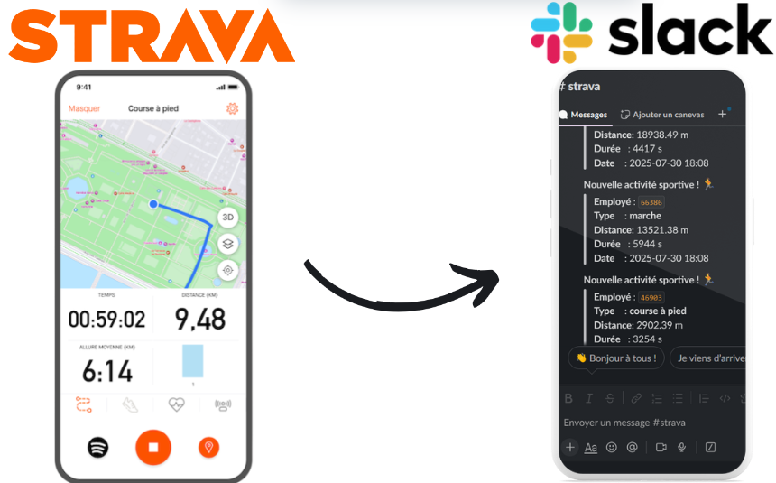
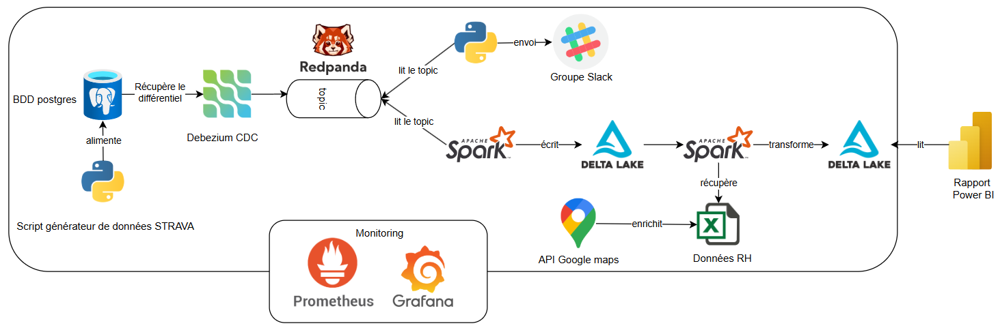
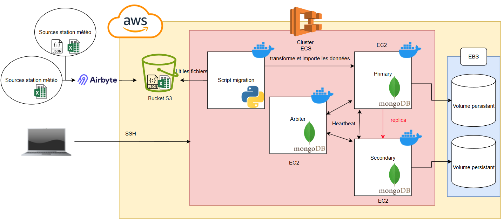
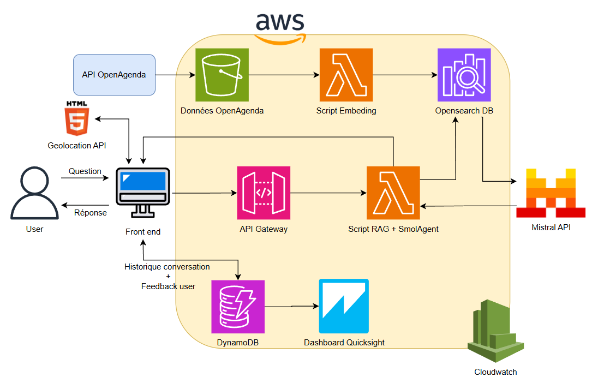

# 👋 Salut!  
# Je suis Lyuta, Data Engineer
Après 4 ans en contrôle de gestion, j’ai évolué vers le data engineering pour automatiser et fiabiliser des flux de données à grande échelle. Je conçois et déploie des pipelines Big Data (Python, SQL, Spark, Kafka/Redpanda, Delta Lake) et des architectures Cloud (AWS, Docker), avec une expertise en ETL/ELT, orchestration (Kestra, Airflow) et data visualization (Power BI, Grafana).  
Mon atout ? Une double compétence : compréhension métier acquise en finance et maîtrise des outils techniques pour transformer la donnée en décisions.

## 🧑‍💻 À propos
- 🎓 Master Contrôle de gestion + Master Data Engineering  
- 💼 4 ans en contrôle de gestion → transition vers la data  
- 🚀 Spécialiste ETL/ELT, streaming temps réel, monitoring et pipelines cloud  

## 🛠️ Compétences
- **Langages** : Python, SQL 
- **Data Engineering** : ETL/ELT, Kafka/Redpanda (streaming), Spark, Delta Lake, MongoDB, PostgreSQL  
- **Orchestration** : Kestra, Airflow  
- **Cloud & Infra** : AWS, Docker
- **Visualisation** : Power BI (reporting métier), Grafana (monitoring technique)  
- **MLops (notions)** : Feature engineering, entraînement/évaluation, industrialisation (BentoML)  

## 🚀 Projets

### Sport Data Solution — ETL streaming d'activités sportives

  

Architecture : Redpanda/Kafka • PySpark Structured Streaming • Delta Lake • Slack API • Power BI

**Objectif:** Récompenser l’activité sportive (trajet domicile/travail et extra-professionnel) sous forme de prime + envoyer des Notification Slack pour renforcer l'émulation de l'équipe 
**Stack:** PostgreSql → Debezium → Redpanda/Kafka → PySpark → Delta Lake → Power BI  
                                                  → Slack API  
**Rôle / actions:**
- Ingestion temps réel des données Strava
- Delta lake bronze (données brutes) & gold (données transformées)
- Enrichissement via données RH + calcul des primes via des rêgles d'éligibilités (consumer spark streaming)
- Notifications en live via l'API Slack  (consumer Python)
- Dashboard PowerBI pour suivre les indicateurs (taux éligibilité, coût des primes ...)
- Monitoring : Prometheus + Grafana (temps de latence, pics, erreurs ...)

  

**Impact:**
- Latence **< 2 s** sur notifications  
- Calcul automatique des primes et indicateurs visualisable sur PowerBI
- Possibilité de changement des rêgles d'attribution pour recalcul

[Lien vers le projet](https://github.com/majinlyut/sport_data_solution)

* * *
* * *

### Energy Weather Data Pipeline

  

**Objectif:** Améliorer la fiabilité des prévisions électriques vertes en zones peu couvertes en ajoutant des sources météo semi-amateurs.  
**Stack:** Airbyte → MongoDB Replica Set (AWS ECS)  → CloudWatch.  
**Rôle / actions:**
- Architecture multi-sources (normalisation + contrôles qualité)  
- Déploiement MongoDB en Replica Set (EC2/ECS)  
- Monitoring: métriques + logs CloudWatch  
- Tests de validation (completeness, duplicates)  

  

**Impact:**
- Plus de données météo exploitables  
- Moins de temps de traitement  
- Disponibilité accrue, scalable et sécurisé  

[Lien vers le projet](https://github.com/majinlyut/weather_data_pipeline)

* * *
* * *

### RAG Chatbot de recommandation d'évènements

  

**Objectif.** Faciliter l’accès aux évènements internes et externes via un assistant intelligent, capable de fournir des réponses contextualisées et personnalisées.  
**Stack:** AWS (S3, Lambda, API Gateway, OpenSearch, DynamoDB, Quicksight, CloudWatch) + Mistral API  
**Rôle / actions.**
- Ingestion des données OpenAgenda → stockage sur S3
- Lambda : chunking + embeddings, indexation dans OpenSearch
- API Gateway → script RAG connecté à Mistral API pour génération de réponses
- Gestion de l’historique conversationnel + feedback utilisateurs avec DynamoDB
- Analyse des retours utilisateurs via dashboard Quicksight
- Monitoring complet de l’architecture avec CloudWatch

  

**Impact.**
- Temps de recherche amélioré
- Satisfaction utilisateur ↑ grâce à des réponses contextualisées
- Scalabilité et résilience grâce à l’architecture cloud-native sur AWS

[Lien vers le projet](https://github.com/majinlyut/rag_chatbot_event_Paris)

* * *
* * *

## 📬 Contact

- Email : [lyuta.nakata@gmail.com.com](mailto:lyuta.nakata@gmail.com)  
- LinkedIn : [https://linkedin.com/in/lyuta ](https://www.linkedin.com/in/lyuta-nakata/) 
- GitHub : [https://github.com/majinlyut](https://github.com/majinlyut)

_Dernière mise à jour : 2025‑08‑18_

